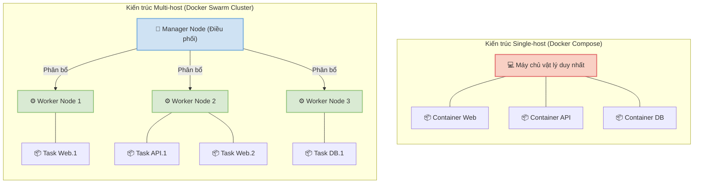

# 1. Giới thiệu Docker Swarm và Container Orchestration

## 1.1. Container Orchestration và bài toán giải quyết

Khái niệm:
Container Orchestration (điều phối container) không chỉ là một công cụ, mà là một nền tảng tư duy chiến lược trong việc vận hành kiến trúc phần mềm hiện đại. Đây là quá trình tự động hóa toàn diện vòng đời của các container, bao gồm khởi tạo, triển khai, quản lý trạng thái, mở rộng quy mô, và kết nối mạng trong một môi trường sản xuất có tính phân tán và yêu cầu tính khả dụng cao.

Bài toán giải quyết:
Sự dịch chuyển từ kiến trúc ứng dụng monolithic sang microservices dẫn đến việc hệ thống bị chia nhỏ thành nhiều phần độc lập. Yêu cầu vận hành thực tế đòi hỏi triển khai hàng trăm hoặc hàng ngàn container trên các cụm máy chủ khác nhau. Việc quản lý thủ công lúc này bộc lộ những điểm nghẽn nghiêm trọng:
- Tính sẵn sàng (High Availability): Khi máy chủ vật lý gặp sự cố, hệ thống thiếu cơ chế tự động phát hiện và khởi động lại container trên các máy chủ dự phòng.
- Khả năng mở rộng (Scalability): Hệ thống thiếu khả năng tự động gia tăng số lượng container khi lưu lượng truy cập tăng vọt, cũng như không tự động thu hẹp khi lưu lượng giảm nhằm tối ưu hóa tài nguyên.
- Triển khai phiên bản không gián đoạn (Zero-downtime deployment): Việc cập nhật phần mềm dễ gây rớt kết nối và ảnh hưởng đến trải nghiệm người dùng cuối.
- Cân bằng tải (Load Balancing): Khó khăn trong việc điều phối khối lượng lớn yêu cầu từ người dùng đến các container đang trống tải một cách đồng đều.

Container Orchestration ra đời nhằm tự động giải quyết các hạn chế trên, duy trì hệ thống luôn ở trạng thái vận hành lý tưởng.

---

## 1.2. Khái niệm Docker Swarm

Bối cảnh ra đời:
Trong thời kỳ hệ sinh thái điện toán đám mây bùng nổ, Kubernetes nhanh chóng vươn lên trở thành tiêu chuẩn công nghiệp (de-facto standard) cho các hệ thống siêu lớn. Tuy nhiên, kiến trúc của Kubernetes đi kèm với độ phức tạp vận hành cực kỳ cao, đòi hỏi đội ngũ chuyên trách và tài nguyên phần cứng lớn. Nhận thấy khoảng trống này, Docker Inc. đã phát triển Docker Swarm như một giải pháp đối trọng hoàn hảo. Swarm ra đời mang theo triết lý "đơn giản hóa", hướng tới các doanh nghiệp và dự án quy mô nhỏ/vừa (SMB) cần một hệ thống điều phối ổn định, bảo mật cao nhưng không đòi hỏi chi phí vận hành đắt đỏ.

Khái niệm cốt lõi:
Docker Swarm là nền tảng Container Orchestration được tích hợp sẵn (native) ngay bên trong lõi Docker Engine. Thay vì cài đặt phức tạp, người dùng chỉ cần kích hoạt tính năng này để liên kết nhiều máy chủ vật lý hoặc máy ảo riêng lẻ thành một cụm (cluster) thống nhất mang tên Swarm.

Mục đích và nguyên lý hoạt động:
- Mục đích: Lược bỏ những tính năng dư thừa, tập trung vào khả năng triển khai nhanh chóng và duy trì trạng thái của dịch vụ, mang lại hiệu năng cao mà không làm quá tải đội ngũ vận hành.
- Nguyên lý hoạt động: Hệ thống hoạt động dựa trên cơ chế phân quyền hai lớp máy chủ:
  - Manager Node: Đóng vai trò điều khiển trung tâm. Có nhiệm vụ duy trì trạng thái của cụm, tiếp nhận cấu hình, lập lịch và phân bổ khối lượng công việc cho các node khác. Node này cũng liên tục giám sát trạng thái hệ thống để phản ứng kịp thời với các sự cố.
  - Worker Node: Đóng vai trò thực thi. Chức năng chính là tiếp nhận yêu cầu từ Manager và khởi chạy các tiến trình container.

Thiết kế này giúp người quản trị hệ thống tương tác với toàn bộ cụm máy chủ phân tán thông qua một Manager Node duy nhất, ẩn đi toàn bộ tính phức tạp của hệ thống mạng vật lý bên dưới.

---

## 1.3. Phân tích ưu và nhược điểm của Docker Swarm

Ưu điểm nổi bật:
- Đường cong học tập phẳng: Nhờ được tích hợp sẵn trong Docker Engine, hệ thống không yêu cầu cài đặt phần mềm bên thứ ba. Nhân sự đã nắm vững Docker có thể dễ dàng chuyển đổi sang vận hành Docker Swarm.
- Khả năng tự phục hồi (Self-Healing): Hoạt động theo nguyên lý Khai báo. Hệ thống liên tục đối chiếu trạng thái thực tế với trạng thái mong muốn. Nếu phát hiện container bị lỗi hoặc Worker Node mất kết nối, hệ thống sẽ tự động khởi tạo lại dịch vụ trên các Node dự phòng để đảm bảo tính liên tục.
- Bảo mật nội tại: Giao tiếp nội bộ giữa các Node trong cụm được mã hóa tự động bằng chứng chỉ TLS hai chiều. Cơ chế xoay vòng chứng chỉ định kỳ giúp ngăn ngừa rủi ro giả mạo và nghe lén.
- Mạng định tuyến thông minh (Ingress Routing Mesh): Hỗ trợ tiếp nhận yêu cầu truy cập từ bất kỳ Node nào trong cụm và tự động định tuyến đến chính xác Node đang chạy ứng dụng tương ứng một cách minh bạch với người sử dụng.

Nhược điểm:
- Hệ sinh thái hạn chế: So với hệ thống điều phối khác như Kubernetes, Docker Swarm sở hữu hệ sinh thái công cụ hỗ trợ và tích hợp mở rộng hạn chế hơn.
- Mở rộng tự động chưa linh hoạt: Hệ thống quản lý tốt việc giữ vững số lượng container được khai báo, nhưng thiếu vắng cơ chế tự động mở rộng theo ngưỡng sử dụng tài nguyên phần cứng thay đổi theo thời gian thực. Việc này thường yêu cầu sự hỗ trợ từ các kịch bản tự động hóa bên ngoài.

---

## 1.4. So sánh kiến trúc: Single-host và Multi-host

Để làm nổi bật sự khác biệt về mặt bản chất, sơ đồ dưới đây minh họa sự tương phản giữa việc triển khai ứng dụng trên một máy chủ đơn lẻ bằng Docker Compose so với việc triển khai trên một cụm máy chủ phân tán bằng Docker Swarm.

Bảng phân tích chuyên sâu các tiêu chí vận hành:

| Tiêu chí | Docker Compose (Single-host) | Docker Swarm (Multi-host) |
| :--- | :--- | :--- |
| Bản chất hạ tầng | Vận hành toàn bộ dịch vụ trên một máy chủ duy nhất. Phụ thuộc vào giới hạn vật lý của thiết bị. | Liên kết nhiều máy chủ thành một khối thống nhất. Tối ưu hóa tổng năng lực xử lý. |
| Mức độ chịu lỗi | Điểm lỗi duy nhất (SPOF). Sự cố phần cứng có thể làm sập toàn bộ hệ thống ngay lập tức. | Tính khả dụng cao (HA). Nếu xảy ra sự cố phần cứng, dịch vụ tự động khôi phục trên thiết bị khác. |
| Khả năng phân phối tải | Cân bằng tải giới hạn trong phạm vi cục bộ của một thiết bị vật lý. | Tích hợp Ingress Routing Mesh, tự động phân phối lưu lượng trên quy mô toàn mạng lưới. |
| Quy trình cập nhật | Có thể gây gián đoạn dịch vụ khi khởi động lại các container cũ và mới. | Áp dụng kỹ thuật cập nhật cuốn chiếu (Rolling Updates), đạt ngưỡng không gián đoạn dịch vụ. |
| Phạm vi ứng dụng | Phù hợp với môi trường phát triển và thử nghiệm nội bộ. | Thiết kế cho môi trường sản xuất thực tế đòi hỏi tính ổn định và tính liên tục. |

---

## 1.5. Các kịch bản ứng dụng thực tế

Giải pháp Docker Swarm mang lại giá trị vận hành cao trong nhiều trường hợp thực tiễn:

1. Vận hành kiến trúc Microservices:
Đối với hệ thống thương mại điện tử bao gồm nhiều dịch vụ độc lập như hệ thống giỏ hàng, cổng thanh toán và vận chuyển. Docker Swarm cung cấp khả năng điều phối linh hoạt, cho phép dịch vụ giỏ hàng chạy nhiều bản sao để chịu tải trong khi dịch vụ vận chuyển sử dụng ít tài nguyên hơn. Sự cố mã nguồn ở một dịch vụ được cô lập và không gây ảnh hưởng đến toàn bộ hệ thống.

2. Triển khai phần mềm không gián đoạn:
Áp dụng cho các hệ thống tài chính cần thực hiện nâng cấp phiên bản trong giờ giao dịch. Thông qua tính năng Rolling Update, hệ thống lần lượt thay thế từng container mà vẫn đảm bảo định tuyến các giao dịch mới vào những container đang hoạt động ổn định, đảm bảo tính liên tục của dịch vụ đối với khách hàng.

3. Xử lý tác vụ nền cường độ cao:
Sử dụng trong các hệ thống phân tích dữ liệu lớn. Bằng cách bổ sung thêm thiết bị điện toán chi phí thấp vào mạng lưới Worker Node, hệ thống có thể chia nhỏ khối lượng công việc và phân bổ đều cho các thiết bị xử lý song song, giải quyết bài toán gia tăng năng lực tính toán theo chiều ngang.

4. Đảm bảo tính khả dụng cho dịch vụ API:
Hỗ trợ các nền tảng ứng dụng di động duy trì đồng bộ dữ liệu liên tục. Dịch vụ API được phân tán trên nhiều máy chủ vật lý. Khi xảy ra sự cố ngắt kết nối mạng tại một máy chủ, cơ chế Routing Mesh ngay lập tức phát hiện, từ chối yêu cầu tiếp cận máy chủ lỗi và chuyển hướng lưu lượng sang các máy chủ còn lại.
