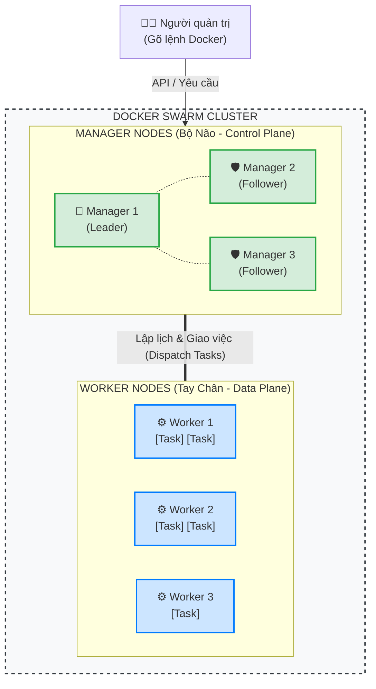

# 2. Kiến trúc cốt lõi của Docker Swarm

Kiến trúc Docker Swarm được thiết kế dựa trên nguyên lý phân tán và chuyên môn hóa vai trò, giúp liên kết hàng loạt máy chủ độc lập thành một hệ thống thống nhất và có khả năng chịu lỗi cao.

---

## 2.1. Bức tranh tổng quan về Kiến trúc Swarm

Một cụm Swarm không phải là một thực thể vật lý duy nhất, mà là một mạng lưới logic kết nối các máy chủ cài đặt Docker (được gọi là Node) thông qua cơ sở hạ tầng mạng nội bộ. Khi tham gia vào Swarm, các máy chủ ngừng hoạt động như các thực thể độc lập và tuân thủ cơ chế điều phối tập trung.

Kiến trúc được chia làm hai phân hệ rõ rệt:
- Lớp điều khiển (Control Plane): Bao gồm các Manager Nodes.
- Lớp thực thi (Data Plane): Bao gồm các Worker Nodes.



---

## 2.2. Phân tích vai trò: Manager Node và Worker Node

Sự phân tách giữa Manager và Worker được thiết kế nhằm tối ưu hóa hiệu năng và cô lập rủi ro hệ thống.

### 2.2.1. Manager Node
Manager Node đóng vai trò là trung tâm điều khiển của toàn bộ hệ thống. Nhiệm vụ chính không phải là thực thi ứng dụng, mà là duy trì tính ổn định của cụm Swarm.

Các nhiệm vụ cốt lõi:
- Duy trì trạng thái cụm: Lưu trữ và quản lý thông tin trạng thái hoạt động của các Node, số lượng bản sao cần thiết của từng dịch vụ và cấu hình mạng nội bộ.
- Điều phối và lập lịch: Tiếp nhận yêu cầu triển khai dịch vụ, phân tích năng lực tài nguyên của các Worker Node để phân bổ nhiệm vụ (Task) một cách tối ưu.
- Cung cấp giao diện tương tác: Đóng vai trò là cửa ngõ duy nhất tiếp nhận các lệnh từ người quản trị hệ thống hoặc các nền tảng tự động hóa CI/CD. Cơ chế này đạt được thông qua việc Manager Node phơi bày các Docker API endpoint an toàn, cho phép các công cụ bên ngoài kết nối và gửi cấu hình triển khai một cách tự động.

Nguyên lý vận hành thực tế: Trong môi trường sản xuất, Manager Node thường được cấu hình rút quyền thực thi ứng dụng. Thiết lập này nhằm bảo toàn năng lực xử lý cho các quyết định điều phối, tránh hiện tượng quá tải phần cứng do ứng dụng người dùng gây ra, dẫn đến sự cố toàn hệ thống.

Các lệnh quản trị Manager cơ bản:
```bash
# Xem danh sách toàn bộ các Node trong cụm và trạng thái của chúng
docker node ls

# Thăng cấp một Worker Node lên thành Manager Node
docker node promote <node-id>

# Giáng cấp một Manager Node xuống thành Worker Node
docker node demote <node-id>
```
### 2.2.2. Worker Node
Worker Node đóng vai trò thực thi các chỉ thị từ Manager Node.

Đặc điểm nhận diện:
- Tiếp nhận chỉ thị: Nhận nhiệm vụ từ Manager và tiến hành khởi tạo các tiến trình container.
- Báo cáo trạng thái: Liên tục truyền tải tín hiệu duy trì hoạt động và báo cáo tình trạng tài nguyên về trung tâm quản lý.
- Giới hạn quyền hạn: Worker Node không tham gia lưu trữ trạng thái hệ thống, không nắm giữ thuật toán đồng thuận và không có quyền truy xuất thông tin tổng thể của mạng lưới.

Khía cạnh bảo mật: Thiết kế này cô lập rủi ro một cách hiệu quả. Trong trường hợp một máy chủ Worker bị xâm nhập, phạm vi ảnh hưởng chỉ dừng lại ở các container chạy trên máy chủ đó, không thể tác động đến quyền điều khiển của toàn bộ cụm.
Các lệnh thao tác với Worker Node:
```bash
# Lấy chuỗi mã xác thực (token) trên Manager Node để cho phép Worker mới tham gia
docker swarm join-token worker

# Lệnh thực thi trên máy chủ Worker mới để gia nhập vào cụm
docker swarm join --token <chuỗi-token> <IP-của-Manager>:2377

# Lệnh kiểm tra trạng thái chi tiết của một Node bất kỳ
docker node inspect <node-id> --pretty
```
---

## 2.3. Giao thức đồng thuận Raft

Giao thức Raft giải quyết bài toán đồng bộ dữ liệu trong hệ thống phân tán, đảm bảo các Manager Node luôn thống nhất và chia sẻ một bộ nhớ trạng thái duy nhất.

### 2.3.1. Bài toán của hệ thống phân tán
Khi hệ thống có nhiều máy chủ quản lý, các yêu cầu cấu hình có thể diễn ra đồng thời. Việc thiếu cơ chế đồng thuận sẽ dẫn đến mâu thuẫn dữ liệu và làm sụp đổ kiến trúc logic của hệ thống.

### 2.3.2. Ý tưởng cơ bản của Raft
Raft hoạt động dựa trên cơ chế bầu cử để chọn ra một máy chủ lãnh đạo duy nhất.
- Trong toàn bộ cụm Manager, chỉ một thiết bị được bầu làm Leader. Các thiết bị còn lại đảm nhận vai trò Follower.
- Mọi yêu cầu thay đổi cấu hình hệ thống bắt buộc phải được chuyển tiếp cho Leader.
- Leader có trách nhiệm ghi nhận và sao chép chỉ thị đó đến các Follower.
- Thay đổi chỉ được thực thi khi nhận được xác nhận thành công từ đa số các Follower.

### 2.3.3. Thuật toán Quorum và cấu trúc số lẻ
Sự ổn định của Raft phụ thuộc vào quy định Quorum, tức là đa số quá bán. Công thức tính Quorum là (N/2) + 1, trong đó N là tổng số Manager Node. Hệ thống chỉ duy trì hoạt động khi số lượng Manager Node trực tuyến đạt hoặc vượt mức Quorum.

Bảng tiêu chuẩn chịu lỗi:

| Số lượng Manager | Mức Quorum yêu cầu | Khả năng chịu lỗi phần cứng tối đa |
|:---:|:---:|:---:|
| 1 | 1 | 0 máy (Lỗi 1 máy dẫn đến sập hệ thống) |
| 3 | 2 | 1 máy (Đảm bảo Quorum với 2 máy còn lại) |
| 4 | 3 | 1 máy (Lỗi 2 máy dẫn đến sập hệ thống) |
| 5 | 3 | 2 máy (Đảm bảo Quorum với 3 máy còn lại) |
| 7 | 4 | 3 máy (Đảm bảo Quorum với 4 máy còn lại) |

Phân tích hiện tượng Split-Brain:
Việc thiết lập số lượng Manager là số lẻ (3 hoặc 5) nhằm ngăn chặn hiện tượng phân liệt não (Split-Brain). Trong trường hợp gián đoạn kết nối mạng chia cắt cụm 2 máy chủ thành 2 phần cô lập, mỗi máy sẽ tự ứng cử làm Leader. Sự thiếu hụt cơ chế quá bán khiến cả hai không thể phân định quyền lực, dẫn đến xung đột hệ thống. Với cấu trúc 3 máy chủ, nếu 1 máy bị cô lập, 2 máy còn lại tạo thành đa số (đạt mức Quorum) và duy trì quyền điều hành ổn định, trong khi máy bị cô lập sẽ tạm dừng hoạt động cho đến khi mạng được khôi phục.

---

## 2.4. Khía cạnh kết nối mạng trong Swarm

Hoạt động của cụm Swarm yêu cầu cấu hình chính xác các cổng kết nối trên hệ thống tường lửa để đồng bộ với mô hình kiến trúc phân lớp:

- Cổng 2377 (TCP): Đảm nhiệm vai trò cốt lõi cho Control Plane (Lớp điều khiển). Cổng này hỗ trợ giao tiếp nội bộ chuyên trách giữa các Manager Node và chịu trách nhiệm phân bổ công việc xuống các Worker Node. Toàn bộ dữ liệu truyền tải tại đây đều được mã hóa TLS mức độ cao.
- Cổng 7946 (TCP/UDP): Giao tiếp giám sát trạng thái giữa toàn bộ các Node trong cụm. Ứng dụng giao thức Gossip để các thiết bị liên tục thăm dò tín hiệu (heartbeat) của nhau.
- Cổng 4789 (UDP): Đảm nhiệm vai trò lưu thông cho Data Plane (Lớp thực thi). Cổng này hỗ trợ trực tiếp cho mạng Overlay, cho phép dữ liệu truyền tải thông suốt giữa các container nằm trên các máy chủ vật lý khác nhau thông qua cơ chế mã hóa đường hầm VXLAN, tạo ra một không gian mạng nội bộ thống nhất.

Để các thiết bị có thể giao tiếp không rào cản khi tham gia vào cụm, người quản trị cần mở các cổng trên thông qua hệ thống tường lửa (Ví dụ với UFW trên hệ điều hành Ubuntu/Debian):
```bash
sudo ufw allow 2377/tcp
sudo ufw allow 7946/tcp
sudo ufw allow 7946/udp
sudo ufw allow 4789/udp
```
