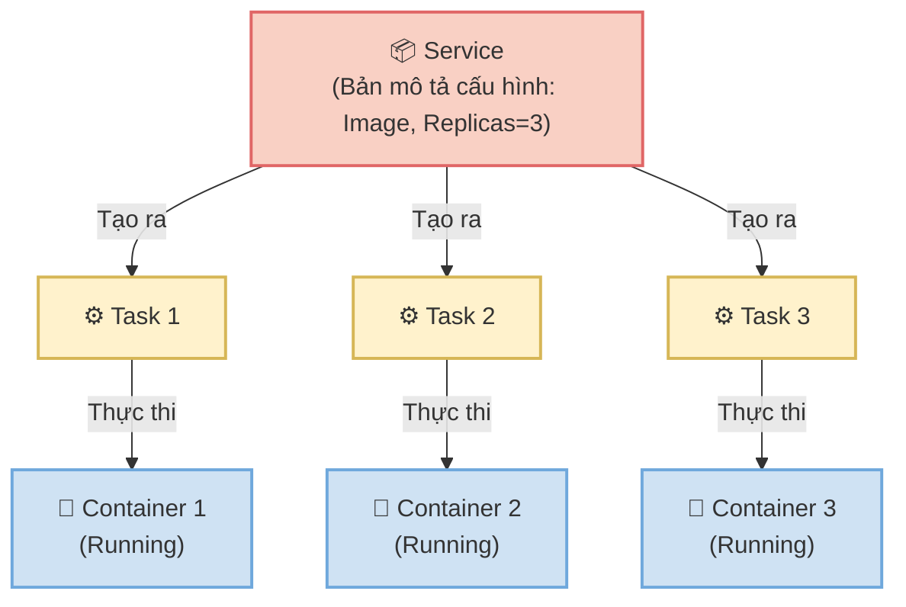

# 3. Phân tích chuyên sâu: Services và Tasks trong Docker Swarm

Để làm chủ Docker Swarm, yêu cầu tiên quyết là chuyển đổi phương pháp quản lý từ việc can thiệp vào từng container riêng lẻ sang phương pháp quản lý trạng thái thông qua Service. Đây là bước tiến quan trọng trong kiến trúc Container Orchestration.

---

## 3.1. Sự chuyển đổi phương pháp: Từ lệnh docker run đến Swarm Service

Trong quá trình tiếp cận ban đầu với Docker, lệnh docker run thường được sử dụng để khởi chạy một container. Tuy nhiên, đối với các hệ thống quy mô lớn, phương pháp này tồn tại nhiều hạn chế cơ bản.

### 3.1.1. Container độc lập qua lệnh docker run
Bản chất: Phương pháp này ra lệnh trực tiếp cho Docker Engine trên một máy chủ duy nhất để tạo ra một tiến trình container.

Nhược điểm cốt lõi:
- Không có khả năng tự phục hồi: Nếu tiến trình bên trong container gặp lỗi hoặc máy chủ vật lý gặp sự cố, container sẽ dừng hoạt động hoàn toàn. Người quản trị hệ thống bắt buộc phải can thiệp thủ công để khởi động lại.
- Khả năng mở rộng hạn chế: Lệnh docker run không hỗ trợ việc tự động tạo ra nhiều bản sao của ứng dụng và cân bằng tải giữa chúng. Việc mở rộng đòi hỏi cấu hình thủ công từng container và thiết lập các hệ thống cân bằng tải bên ngoài, gây tốn kém thời gian và nguồn lực.

### 3.1.2. Giải pháp Swarm Service
Trong môi trường Swarm, đơn vị triển khai không còn là Container mà là Service.

Bản chất: Service là bản mô tả trạng thái mong muốn của một ứng dụng. Thay vì ra lệnh khởi chạy container cụ thể, người quản trị khai báo yêu cầu hệ thống duy trì một số lượng bản sao nhất định của ứng dụng.

Tính ưu việt: Swarm Manager có nhiệm vụ ghi nhận và đảm bảo trạng thái này. Nếu phát hiện một container bị lỗi, hệ thống tự động khởi tạo một bản sao mới để thay thế. Quá trình tìm kiếm máy chủ có sẵn, cấp phát IP và cấu hình mạng nội bộ được thực hiện hoàn toàn tự động mà không cần sự can thiệp của con người.

---

## 3.2. Khái niệm Service

Service là cấu trúc logic cao cấp nhất mà người sử dụng tương tác trong Swarm để triển khai một microservice. Một Service bao bọc và định nghĩa toàn bộ các thuộc tính vận hành của ứng dụng:

- Image được sử dụng (Ví dụ: nginx:1.24).
- Số lượng bản sao (replicas) cần thiết.
- Cổng kết nối được mở ra bên ngoài.
- Giới hạn tài nguyên phần cứng (Ví dụ: Tối đa 512MB RAM).
- Mạng ảo được gắn kết.

Cách sử dụng và ý nghĩa các tham số:
```bash
docker service create \
  --name web-frontend \
  --replicas 3 \
  --publish published=80,target=80 \
  --network frontend-net \
  --update-delay 10s \
  nginx:alpine
```
Phân tích lệnh: Câu lệnh trên không khởi tạo trực tiếp 3 container. Nó ghi nhận một cấu hình mang tên web-frontend vào hệ thống lưu trữ của Manager thông qua giao thức Raft. Dựa trên thông số replicas là 3, Manager sẽ tiến hành tìm kiếm 3 Worker Node phù hợp nhất và phân bổ công việc khởi tạo tiến trình Nginx, đồng thời kết nối chúng vào mạng frontend-net. Tham số update-delay 10s quy định khoảng thời gian chờ 10 giây giữa các lần cập nhật từng bản sao, nhằm đảm bảo dịch vụ không bị gián đoạn.

---

## 3.3. Khái niệm Task

Nếu Service đóng vai trò là bản thiết kế kiến trúc, thì Task là đơn vị thực thi bản thiết kế đó.

Khái niệm: Task là đơn vị công việc nhỏ nhất trong Docker Swarm. Mỗi Task đảm nhiệm việc vận hành chính xác một Container. Khi một Service được yêu cầu chạy 3 bản sao, Manager sẽ tạo ra 3 Tasks. Sau đó, Manager phân bổ các Tasks này đến các Worker Node.

Vòng đời của một Task:
Khác với Container có thể thực hiện các lệnh start, stop, pause, một Task hoạt động theo một quy trình một chiều:

```text
NEW → PENDING → ASSIGNED → ACCEPTED → PREPARING → STARTING → RUNNING
```

Cơ chế xử lý lỗi:
Khi Container bên trong một Task gặp sự cố ngừng hoạt động, trạng thái của Task đó sẽ chuyển thành FAILED. Hệ thống Swarm không khởi động lại một Task đã lỗi. Thay vào đó, nó loại bỏ Task cũ và tạo ra một Task hoàn toàn mới với mã định danh mới. Task mới này sẽ khởi chạy một Container mới để bù đắp vào số lượng bản sao mà Service đã yêu cầu.

Mối quan hệ thành phần:
Người quản trị thiết lập cấu hình thông qua Service. Service chỉ định số lượng Task. Task đảm nhiệm quá trình khởi chạy thực tế của Container.



---

## 3.4. Phân biệt Replicated Services và Global Services

Khi khởi tạo Service, người quản trị cần lựa chọn chế độ triển khai. Yếu tố này quyết định phương thức phân bổ ứng dụng trên toàn bộ hệ thống máy chủ.

### 3.4.1. Replicated Services
Khái niệm: Chế độ cho phép chỉ định chính xác số lượng bản sao cần chạy. Swarm sẽ tự động phân bổ số lượng Tasks này trên toàn cụm máy chủ một cách ngẫu nhiên hoặc dựa trên tài nguyên rảnh rỗi.

Cách sử dụng: Khai báo cờ --mode replicated (nếu bỏ trống, hệ thống sẽ áp dụng mặc định).

Ví dụ thực tiễn: Trong một cụm có 10 máy chủ nhưng yêu cầu chỉ cần 3 bản sao ứng dụng web, hệ thống sẽ lựa chọn 3 máy chủ có tài nguyên tốt nhất để phân bổ công việc.

Trường hợp ứng dụng:
- Web Backend và API Server: Các dịch vụ có lưu lượng truy cập biến động mạnh. Khi tải lượng tăng cao, có thể dễ dàng tăng số lượng bản sao để đáp ứng, và giảm bớt khi lưu lượng trở về mức bình thường nhằm tối ưu tài nguyên.
- Worker xử lý hàng đợi: Các tiến trình chạy nền xử lý khối lượng dữ liệu lớn từ hàng đợi, yêu cầu xử lý song song để tăng tốc độ phản hồi.

### 3.4.2. Global Services
Khái niệm: Chế độ triển khai tự động phân bổ chính xác một Task trên mỗi Node hiện có trong cụm. Người quản trị không được phép chỉ định số lượng bản sao.

Cách sử dụng: Thêm cờ --mode global vào câu lệnh khởi tạo.

Ví dụ thực tiễn: Trong cụm có 3 máy chủ, hệ thống tự động triển khai 3 Tasks. Khi bổ sung thêm 2 máy chủ mới vào mạng lưới, hệ thống tiếp tục tự động triển khai thêm 2 Tasks lên các máy chủ mới này mà không cần cấu hình thêm.

Trường hợp ứng dụng:
- Hệ thống Giám sát: Triển khai các công cụ đo lường hệ thống. Chức năng thu thập dữ liệu phần cứng đòi hỏi mọi máy chủ vật lý đều phải có một bản sao hoạt động.
- Hệ thống Bảo mật: Phân bổ các phần mềm quét mã độc hoặc giám sát lưu lượng mạng trên toàn bộ các máy ảo.
- Log Forwarder: Triển khai hệ thống đẩy nhật ký tập trung nhằm thu thập bản ghi hoạt động từ các thiết bị và chuyển tiếp về kho lưu trữ.

Bảng so sánh:

| Tiêu chí phân loại | Replicated Service | Global Service |
|:---|:---|:---|
| Định đoạt số lượng | Do người quản trị chỉ định thủ công | Phụ thuộc hoàn toàn vào số lượng Node trong cụm |
| Phân bổ tài nguyên | Một máy chủ có thể chạy nhiều task hoặc không chạy task nào | Mỗi máy chủ chạy duy nhất một task |
| Bản chất ứng dụng | Dành cho các ứng dụng nghiệp vụ | Dành cho các công cụ hạ tầng và giám sát |
| Khi nào nên dùng | Triển khai Web, API, Database cần thu phóng linh hoạt theo tải lượng hệ thống | Triển khai các công cụ đo lường (Prometheus Node Exporter), thu thập log (Fluentd), hoặc Antivirus |

---

## 3.5. Kiểm soát vị trí triển khai

Trong thực tế vận hành, cụm máy chủ thường bao gồm các thiết bị có cấu hình phần cứng khác nhau. Placement Constraints là bộ quy tắc hỗ trợ hệ thống điều hướng các Task đến những máy chủ đáp ứng đúng các tiêu chuẩn phần cứng hoặc phân vùng mạng định trước.

Ví dụ minh họa:
```bash
docker service create \
  --name ai-processor \
  --constraint "node.labels.hardware==gpu" \
  python-ai:latest
```
Lệnh trên quy định hệ thống chỉ phân bổ các tác vụ xử lý AI xuống các máy chủ đã được gắn nhãn sở hữu phần cứng đồ họa chuyên dụng. Cơ chế này hỗ trợ tối ưu hóa chi phí và hiệu suất tài nguyên máy chủ. Ngoài ra, việc kết hợp quy tắc loại trừ có thể giúp bảo vệ các Manager Node khỏi sự quá tải từ ứng dụng của người dùng.
