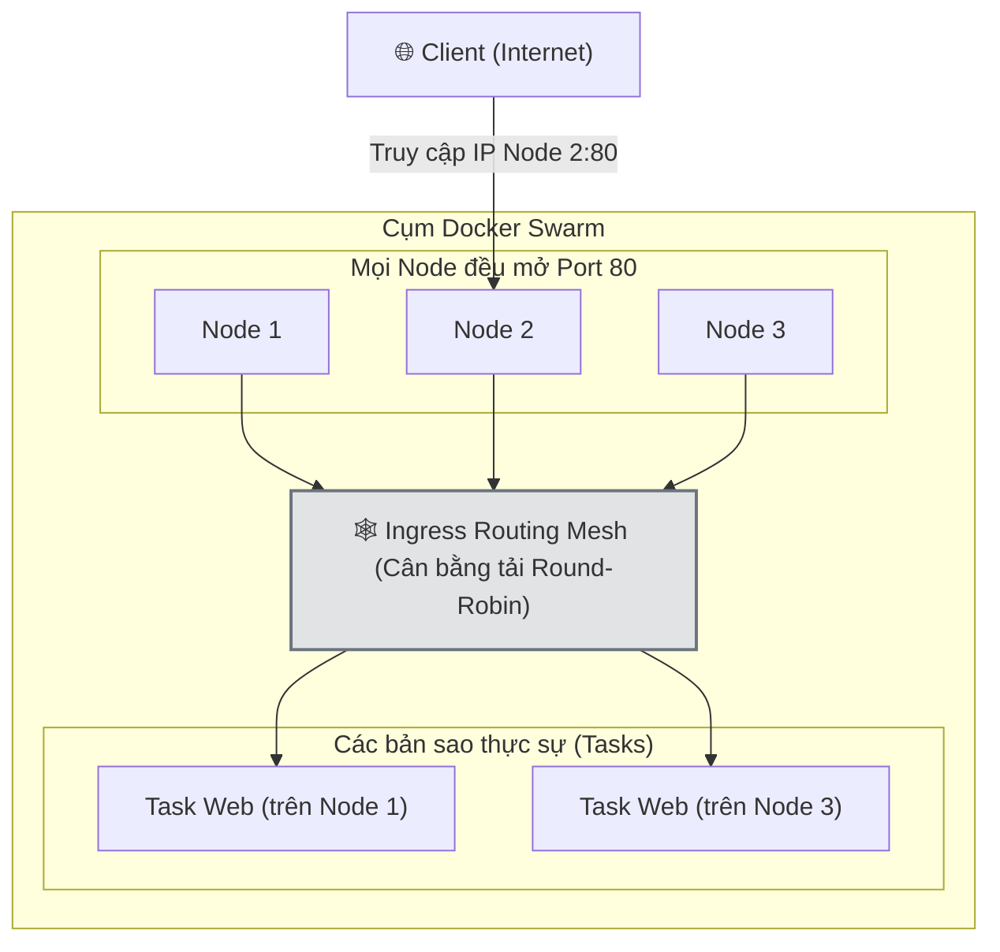

# 4. Phân tích kỹ thuật: Cân bằng tải và Mở rộng quy mô (Scaling & Load Balancing)

Trong các hệ thống phân tán quy mô lớn, khả năng đáp ứng lượng truy cập đột biến và phân phối tải đồng đều là hai yếu tố sống còn. Docker Swarm cung cấp các cơ chế nội tại mạnh mẽ để giải quyết triệt để hai bài toán này thông qua tính năng Mở rộng quy mô (Scaling) và Mạng lưới định tuyến (Routing Mesh).

---

## 4.1. Cơ chế mở rộng quy mô (Scaling)

Khái niệm và Phân loại:
Mở rộng quy mô là quá trình gia tăng hoặc cắt giảm năng lực xử lý của một dịch vụ đang hoạt động nhằm đáp ứng sự thay đổi của tải lượng hệ thống. Có hai phương pháp chính:
- Mở rộng ngang (Horizontal Scaling - Scale Out/In): Đây là cơ chế cốt lõi của Swarm, thực hiện bằng cách tăng hoặc giảm số lượng bản sao (replicas) của container.
- Mở rộng dọc (Vertical Scaling - Scale Up/Down): Thay đổi giới hạn tài nguyên (CPU, RAM) cho các container hiện có thông qua các lệnh cập nhật dịch vụ.

Giới hạn về Auto-scaling (Tự động mở rộng theo tải):
Cần đặc biệt lưu ý rằng: Khác với Kubernetes (có HPA), Docker Swarm không tích hợp sẵn tính năng tự động mở rộng theo tải (metric-based auto-scaling). Mặc dù Swarm hỗ trợ thay đổi số lượng bản sao cực kỳ nhanh, bản thân nó không tự động theo dõi %CPU/RAM để quyết định scale. Để làm được điều này trong thực tế sản xuất, hệ thống bắt buộc phải tích hợp lớp tự động hóa bên ngoài (ví dụ: dùng Prometheus theo dõi CPU, kết hợp Webhook/Script gọi Docker API để scale ra khi CPU > 80%).

Mục đích:
- Tối ưu hóa hiệu suất: Đảm bảo ứng dụng luôn có đủ năng lực xử lý trong các khung giờ cao điểm.
- Tiết kiệm chi phí: Thu hồi tài nguyên không cần thiết khi lưu lượng hệ thống giảm sút, đặc biệt quan trọng trong các nền tảng điện toán đám mây.

Phương thức thực hiện:
Quá trình điều chỉnh quy mô có thể được thực hiện thông qua thao tác cấu hình trực tiếp:
```bash
# Tăng cấu hình lên 5 bản sao
docker service scale my-web=5
```

Cơ chế hoạt động ngầm:
Khi người quản trị hệ thống phát lệnh tăng số lượng bản sao từ 3 lên 5, Manager Node lập tức phân tích tổng thể cụm máy chủ để tìm kiếm các Worker Node có tài nguyên rảnh rỗi. Sau đó, hệ thống tự động khởi tạo thêm 2 Task mới và phân bổ xuống các Node này. Ngược lại, khi giảm cấu hình, Manager sẽ lựa chọn và tiến hành gỡ bỏ các Task thừa một cách an toàn mà không làm gián đoạn toàn bộ dịch vụ.

Ứng dụng thực tiễn:
Trong các chiến dịch truyền thông hoặc sự kiện mua sắm, lưu lượng truy cập vào hệ thống thương mại điện tử có thể tăng gấp hàng chục lần. Quản trị viên chỉ cần một câu lệnh để nhân bản dịch vụ giỏ hàng lên hàng trăm bản sao. Ngay khi sự kiện kết thúc, số lượng bản sao được tự động thu hẹp xuống mức tối thiểu để giải phóng tài nguyên phần cứng.

---

## 4.2. Khái niệm Ingress Network và Routing Mesh

Khi số lượng bản sao của ứng dụng được nhân lên và phân tán trên nhiều máy chủ vật lý, bài toán tiếp theo là làm thế nào để phân phối lượng yêu cầu truy cập từ bên ngoài một cách đồng đều vào các bản sao này. Docker Swarm giải quyết vấn đề này thông qua cơ chế Ingress Routing Mesh.

### 4.2.1. Ingress Network là gì?
Ingress Network là một mạng ảo dạng Overlay được tích hợp mặc định trong Docker Swarm. Mạng này đóng vai trò như một hệ thống mạng nội bộ diện rộng, kết nối toàn bộ các Node tham gia vào cụm.

### 4.2.2. Cơ chế hoạt động của Routing Mesh
Routing Mesh (Mạng lưới định tuyến) là công nghệ cốt lõi cho phép bất kỳ Node nào trong cụm cũng có khả năng tiếp nhận yêu cầu truy cập từ người sử dụng, ngay cả khi Node đó không hề chạy bất kỳ bản sao nào của ứng dụng được yêu cầu.

Quy trình xử lý luồng dữ liệu:
- Bước 1: Người dùng gửi yêu cầu truy cập vào địa chỉ IP của một Node bất kỳ trong cụm thông qua cổng dịch vụ (ví dụ: port 80).
- Bước 2: Node tiếp nhận tín hiệu. Thông qua kiến trúc Routing Mesh, Node này nhận biết được bản đồ định vị của các Node đang thực sự chạy bản sao của dịch vụ tương ứng.
- Bước 3: Routing Mesh tự động chuyển tiếp yêu cầu đó đến một trong các bản sao đang hoạt động dựa trên thuật toán chia tải vòng tròn (Round-Robin).
- Bước 4: Bản sao xử lý yêu cầu và trả kết quả về thông qua đường dẫn ngầm này.

Minh họa kiến trúc:


Phân tích tình huống:
Dựa trên sơ đồ kiến trúc, người dùng gửi yêu cầu vào Node 2. Thực tế, Node 2 hoàn toàn không lưu trữ Task Web nào. Tuy nhiên, nhờ có Routing Mesh, Node 2 đóng vai trò như một bộ định tuyến trung gian, tự động đẩy yêu cầu sang Task Web đang nằm trên Node 1 hoặc Node 3. Toàn bộ quá trình chuyển tiếp này diễn ra hoàn toàn minh bạch (transparent) đối với người sử dụng bên ngoài.

Ưu điểm tuyệt đối:
- Đơn giản hóa kiến trúc: Người quản trị không cần thiết lập hệ thống cân bằng tải bên ngoài phức tạp để theo dõi sự thay đổi IP của từng tiến trình container.
- Tính khả dụng cao: Trong trường hợp một Node bị lỗi phần cứng, hệ thống cân bằng tải tự động phát hiện và ngừng phân phối lưu lượng vào Node đó, đảm bảo tính liên tục của dịch vụ.

### 4.2.3. Cân bằng tải nội bộ thông qua Virtual IP (VIP)

Trong khi Ingress Routing Mesh chịu trách nhiệm điều phối lưu lượng từ bên ngoài (Internet) vào trong cụm, Docker Swarm còn sở hữu một cơ chế cân bằng tải thứ hai chuyên xử lý lưu lượng mạng nội bộ: Cơ chế Virtual IP (VIP) kết hợp với hệ thống phân giải tên miền (DNS) nội bộ.

Nguyên lý hoạt động:
Khi một dịch vụ được khởi tạo, Swarm tự động cấp phát cho dịch vụ đó một địa chỉ IP ảo (VIP) cố định và một bản ghi DNS nội bộ tương ứng với tên của dịch vụ.
- Khi một container thuộc dịch vụ này (ví dụ: ứng dụng `web-frontend`) cần giao tiếp với một dịch vụ khác (ví dụ: `api-backend`), nó chỉ cần gọi tên miền `api-backend`.
- Trình chủ DNS nội bộ của Docker sẽ phân giải tên miền này thành địa chỉ VIP của dịch vụ `api-backend`.
- Ngay tại tầng mạng (Layer 4), bộ cân bằng tải nội tại của Swarm sẽ đánh chặn luồng dữ liệu hướng tới VIP này và phân phối nó đến một trong các bản sao (Tasks) thực tế của `api-backend` đang hoạt động dựa trên thuật toán Round-Robin.

Độ sâu lý thuyết và Ưu điểm chiến lược:
Khác với kỹ thuật phân giải DNS truyền thống (DNS Round-Robin) thường vấp phải rủi ro trả về địa chỉ IP của một container đã chết do giới hạn lưu bộ nhớ đệm (DNS cache) tại máy khách, cơ chế VIP xử lý cân bằng tải ở cấp độ hạt nhân mạng (Kernel Networking). VIP đóng vai trò như một mỏ neo cố định, che giấu hoàn toàn sự xuất hiện, biến mất và thay đổi liên tục về địa chỉ IP thực của các container bên dưới, đảm bảo lưu lượng luôn được định tuyến chính xác đến các tiến trình khỏe mạnh.

*Lưu ý: Mặc dù VIP là cấu hình mặc định và tối ưu nhất, Docker Swarm vẫn cho phép người quản trị thiết lập chế độ thay thế `endpoint_mode: dnsrr` (DNS Round-Robin) cho các trường hợp ứng dụng đặc thù cần giao tiếp trực tiếp để lấy danh sách IP gốc của tất cả container thay vì đi qua VIP.*

---

## 4.3. Sự khác biệt giữa Ingress Mode và Host Mode

Khi công bố một cổng dịch vụ ra mạng công cộng, Docker Swarm cung cấp hai chế độ hoạt động:

Chế độ Ingress (Mặc định):
Cổng kết nối được mở đồng loạt trên toàn bộ các Node trong cụm. Bất kể yêu cầu đi vào Node nào, hệ thống Routing Mesh sẽ tiếp nhận và điều hướng. Chế độ này phù hợp với đại đa số các ứng dụng phổ thông nhờ tính tiện lợi và khả năng cân bằng tải tích hợp sâu.

Chế độ Host:
Cổng kết nối chỉ được mở trên chính xác các Node đang chạy bản sao của ứng dụng. Nếu truy cập vào một Node không chứa ứng dụng, kết nối sẽ bị từ chối ngay lập tức.
Ứng dụng thực tiễn: Chế độ Host thường được triển khai khi hệ thống đòi hỏi hiệu năng mạng ở mức tối đa (loại bỏ độ trễ do phải định tuyến qua mạng ảo Ingress) hoặc khi cần tích hợp với các hệ thống cân bằng tải chuyên biệt của doanh nghiệp.

---

## 4.4. Quản trị và phân bổ tài nguyên

Trong môi trường điện toán phân tán, hiện tượng một ứng dụng gặp sự cố và chiếm dụng toàn bộ tài nguyên phần cứng (CPU/RAM) của máy chủ có thể gây hiệu ứng dây chuyền làm sụp đổ hệ thống (hiện tượng Noisy Neighbor). Việc thiết lập các ranh giới tài nguyên là yêu cầu bắt buộc đối với môi trường sản xuất.

Cơ chế quản lý:
Hệ thống cho phép cấu hình các thông số kỹ thuật chặt chẽ cho từng dịch vụ:
- Giới hạn tối đa (Limits): Ngưỡng tài nguyên cao nhất mà hệ thống cho phép ứng dụng tiêu thụ. Nếu vượt qua ngưỡng này, tiến trình có thể bị hệ điều hành cưỡng chế ngừng hoạt động để bảo vệ toàn hệ thống.
- Tài nguyên đặt trước (Reservations): Khối lượng tài nguyên tối thiểu mà hệ thống phải đảm bảo luôn có sẵn cho ứng dụng hoạt động.

Ví dụ cấu hình tiêu chuẩn:
```yaml
deploy:
  resources:
    limits:
      cpus: '0.50'
      memory: 512M
    reservations:
      cpus: '0.25'
      memory: 256M
```
Việc khai báo thông số tài nguyên không chỉ mang tính chất bảo vệ, mà còn cung cấp dữ liệu quan trọng để Manager Node tính toán và ra quyết định tối ưu nhất trong quá trình lựa chọn Worker Node để phân bổ công việc. Hệ thống sẽ chủ động từ chối phân bổ nhiệm vụ vào một máy chủ không đáp ứng đủ mức tài nguyên đặt trước.

Lệnh kiểm tra mức độ tiêu thụ tài nguyên thực tế của các tác vụ đang chạy trên Node:
```bash
docker stats
```
