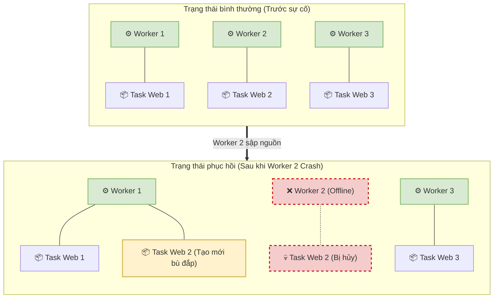

# 7. Tính sẵn sàng cao và Khả năng chịu lỗi (High Availability & Fault Tolerance)

Đảm bảo dịch vụ vận hành liên tục 24/7 dưới sự tác động của các sự cố phần cứng hoặc phần mềm là bài toán kinh điển của kiến trúc hệ thống phân tán. Docker Swarm giải quyết triệt để bài toán này thông qua tính năng tự động phục hồi trạng thái (Desired State Reconciliation) kết hợp với cấu trúc phân quyền chịu lỗi đa lớp.

---

## 7.1. Cơ chế đối chiếu trạng thái mong muốn (Desired State Reconciliation)

Bản chất hoạt động của Docker Swarm tuân theo mô hình khai báo trạng thái (Declarative Model). Người quản trị hệ thống không đưa ra mệnh lệnh trực tiếp cho hệ thống thực thi việc tạo lập container. Thay vào đó, họ khai báo trạng thái mục tiêu, ví dụ: "hệ thống phải luôn duy trì 3 bản sao của ứng dụng".

Cơ chế tự động đối chiếu:
Manager Node liên tục vận hành một vòng lặp kiểm tra ngầm định (Reconciliation Loop). Nhiệm vụ cốt lõi của vòng lặp này là đối chiếu trạng thái thực tế hiện hành (Actual State) với trạng thái lý tưởng đã được khai báo ban đầu (Desired State).
Trong điều kiện hoạt động ổn định, trạng thái thực tế khớp hoàn toàn với trạng thái mong muốn. Tuy nhiên, khi xảy ra sự cố ngắt kết nối hoặc tràn bộ nhớ, dẫn đến sự thiếu hụt cục bộ về số lượng bản sao ứng dụng, hệ thống đối chiếu sẽ lập tức phát hiện sự sai lệch. Ngay sau đó, Manager kích hoạt chuỗi hành động bù đắp: hệ thống tự động khởi tạo thêm các tác vụ mới và phân bổ xuống những Worker Node đang rảnh rỗi nhằm khôi phục nguyên vẹn trạng thái lý tưởng. Toàn bộ chu trình này diễn ra hoàn toàn tự động, tuần hoàn liên tục mà không đòi hỏi bất kỳ sự can thiệp thủ công nào từ phía nhân sự vận hành.

---

## 7.2. Phân tích kịch bản sự cố cấp độ Container (Task Crash)

Kịch bản mô phỏng: 
Trong quá trình vận hành, một tiến trình ứng dụng bên trong container bị kết thúc đột ngột do vượt quá giới hạn bộ nhớ (Out of Memory - OOM) hoặc do phát sinh ngoại lệ mã nguồn (Application Crash).

Quy trình phản ứng của hệ thống:
- Bước 1: Worker Node có nhiệm vụ giám sát container đó phát hiện tiến trình đã kết thúc với mã lỗi. Node lập tức cập nhật trạng thái của tác vụ (Task) từ đang hoạt động sang trạng thái thất bại (FAILED).
- Bước 2: Thông qua giao thức liên lạc nhịp tim (Heartbeat), Manager Node nắm bắt được sự kiện tác vụ bị lỗi. Động thái này dẫn đến sự mất cân bằng trong hệ thống đối chiếu: số lượng bản sao thực tế đã giảm xuống dưới mức yêu cầu của dịch vụ.
- Bước 3: Thay vì cố gắng khởi động lại tác vụ mang mã lỗi, Manager áp dụng chính sách gạch bỏ hoàn toàn tác vụ đó, đồng thời khởi tạo một tác vụ mới tinh với mã định danh hoàn toàn mới.
- Bước 4: Tác vụ mới được bộ lập lịch (Scheduler) phân bổ cho một Worker Node phù hợp. Tiến trình ứng dụng được khởi động lại từ đầu, bù đắp chính xác phần năng lực xử lý bị khuyết thiếu.

Quá trình phát hiện và tái thiết lập này diễn ra cực kỳ nhanh chóng, thông thường chỉ mất vài giây, đảm bảo tổng thể dịch vụ luôn trong trạng thái sẵn sàng phục vụ lượng truy cập từ bên ngoài.

### 7.2.1. Vai trò sống còn của HEALTHCHECK
Nếu chỉ dựa vào sự kiện tiến trình kết thúc (Exit Code), Swarm sẽ không thể phát hiện các lỗi "chết lâm sàng" - ví dụ ứng dụng Java bị treo (deadlock), hoặc Web Server bị quá tải kết nối nhưng tiến trình hệ điều hành vẫn đang chạy. Để khắc phục, thực tế sản xuất bắt buộc phải định nghĩa chỉ thị `HEALTHCHECK` trong Dockerfile hoặc tệp Compose:
```yaml
healthcheck:
  test: ["CMD", "curl", "-f", "http://localhost/health"]
  interval: 30s
  timeout: 10s
  retries: 3
```
Nhờ cơ chế này, Swarm chủ động gọi kiểm tra định kỳ. Nếu ứng dụng không phản hồi thành công sau 3 lần (`retries`), Swarm lập tức đánh dấu Task đó là trạng thái `Unhealthy` và tự động tiêu diệt để tạo Task mới thay thế, bất kể tiến trình gốc bên trong có còn chạy hay không.

---

## 7.3. Phân tích kịch bản sự cố cấp độ Máy chủ vật lý (Worker Node Crash)

Kịch bản mô phỏng: 
Một thiết bị phần cứng đóng vai trò Worker Node đột ngột mất nguồn điện, đứt cáp mạng hoặc hỏng ổ cứng vật lý, kéo theo sự sụp đổ của toàn bộ hệ thống ứng dụng đang hoạt động trên nó.

Quy trình phản ứng của hệ thống:
- Bước 1: Thông qua giao thức giám sát Gossip được thiết lập trên cổng mạng 7946, các Node khác trong cụm mạng nội bộ ngừng nhận được tín hiệu hồi đáp từ máy chủ đang gặp sự cố.
- Bước 2: Manager Node tiếp nhận thông tin và chuyển trạng thái đánh giá máy chủ đó thành ngoại tuyến (Unreachable).
- Bước 3: Đánh giá quy mô thiệt hại. Manager truy xuất cơ sở dữ liệu để liệt kê toàn bộ các tác vụ đang được phân bổ trên máy chủ ngoại tuyến và đồng loạt đánh dấu chúng là thất bại.
- Bước 4: Để tái lập trạng thái cân bằng, Manager tự động tạo ra một loạt các tác vụ thay thế, sau đó lập lịch triển khai khối lượng công việc này và phân bổ đều cho các thiết bị Worker Node còn lại đang hoạt động trong cụm.

Thông qua cơ chế thiết kế này, một thảm họa lỗi phần cứng mức độ máy chủ vật lý được hệ thống chuyển hóa gọn gàng thành một chu trình cấp phát ứng dụng phần mềm đơn giản, giảm thiểu đáng kể rủi ro gián đoạn dịch vụ trên bình diện tổng thể doanh nghiệp.

Sơ đồ minh họa quá trình di tản Task khi Node gặp sự cố:


---

## 7.4. Phân tích kịch bản sự cố cấp độ Lõi điều khiển (Manager Node Crash)

Kịch bản mô phỏng: 
Hệ thống máy chủ trung tâm đảm nhiệm vai trò Manager Node gặp sự cố nghiêm trọng.

Quy trình phản ứng dựa trên thuật toán đồng thuận Raft:
- Trường hợp kiến trúc lỗi thời có duy nhất một Manager Node: Sự sụp đổ của Manager này sẽ khiến toàn bộ cụm mất khả năng quản lý. Mặc dù các ứng dụng đã được khởi chạy trên các Worker Node vẫn tiếp tục phục vụ người dùng, quản trị viên hoàn toàn bất lực trong việc cập nhật phần mềm mới, thu phóng quy mô ứng dụng hoặc xem danh sách dịch vụ. Mô hình điểm lỗi duy nhất (SPOF) này tuyệt đối không được khuyến nghị cho môi trường sản xuất.
- Trường hợp kiến trúc đề xuất với nhiều Manager Node (ví dụ cụm 3 Manager): Thuật toán Raft sẽ bầu ra một hệ thống thiết bị bao gồm một máy chủ lãnh đạo (Leader) và hai máy chủ cấp dưới (Follower). Nếu máy chủ Leader bất ngờ sụp đổ:
  - Giai đoạn 1: Các thiết bị Follower phát hiện sự gián đoạn kết nối định kỳ đối với thiết bị Leader.
  - Giai đoạn 2: Các Follower tự động thay đổi trạng thái sang ứng cử viên (Candidate) và ngay lập tức tổ chức một cuộc bầu cử hệ thống nội bộ.
  - Giai đoạn 3: Thiết bị nào nhận được sự đồng thuận đa số (Quorum) sẽ chính thức trở thành Leader mới và nắm quyền điều hành toàn bộ cụm mạng.
  - Quá trình chuyển giao và tiếp quản quyền lực diễn ra tự động trong khoảng thời gian rất ngắn, đảm bảo cụm máy chủ duy trì được sự điều khiển tập trung mà không gây gián đoạn quyền quản trị vận hành.

---

## 7.5. Tiêu chuẩn cấu hình và xử lý trạng thái bảo trì (Maintenance)

Hệ thống cho phép người quản trị quy định cấu hình khả năng dung lỗi thông qua thuộc tính tự khởi động (`restart_policy`) trong tệp triển khai:
```yaml
deploy:
  restart_policy:
    condition: on-failure
    delay: 5s
    max_attempts: 3
    window: 120s
```
Qua đó, quản trị viên có thể thiết lập chính xác số lần hệ thống cố gắng khởi động lại (`max_attempts`) và thời gian trì hoãn (`delay`) trước khi ngừng nỗ lực khôi phục và đánh dấu hoàn toàn sự thất bại của tác vụ.

Hơn thế nữa, nhằm phục vụ công tác bảo trì hệ thống máy chủ vật lý định kỳ, Swarm cung cấp tính năng thu hồi nút mạng chuyên biệt (Drain Node).
```bash
docker node update --availability drain worker-1
```
Lệnh thực thi trên sẽ chuyển trạng thái hoạt động của máy chủ được chỉ định sang chế độ rút cạn (Drain). Ngay lập tức, máy chủ này sẽ từ chối tiếp nhận các tác vụ mới. Song song đó, Manager Node tiến hành "di tản" toàn bộ các ứng dụng đang tồn tại trên nó sang những máy chủ an toàn khác một cách chủ động và có lộ trình. Đây được xem là một cơ chế phòng ngừa rủi ro chủ động tuyệt vời so với việc phải đối mặt với nguy cơ sụp đổ đột ngột không báo trước.

---

## 7.6. Bảng tổng kết năng lực chịu lỗi của hệ thống

| Tình huống sự cố | Kết quả xử lý của Swarm | Thời gian phục hồi dự kiến |
|----------|---------|-------------------|
| 1 Tiến trình Container bị Crash | Tự động tiêu hủy và khởi tạo Task mới thay thế | < 30 giây |
| 1 Máy chủ Worker Node bị sập | Di tản toàn bộ Tasks sang các Node còn lại | 1-2 phút |
| 1/3 Máy chủ Manager bị sập | Bầu cử Leader mới, duy trì toàn quyền quản trị | < 10 giây |
| 2/3 Máy chủ Manager bị sập | **Mất Quorum (Đồng thuận), Cụm bị đóng băng quản trị** | Cần can thiệp khôi phục thủ công |
| Toàn bộ Manager bị sập | **Hệ thống sụp đổ hoàn toàn** | Cần can thiệp khôi phục thủ công |
